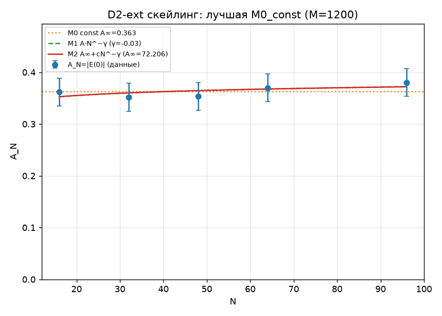
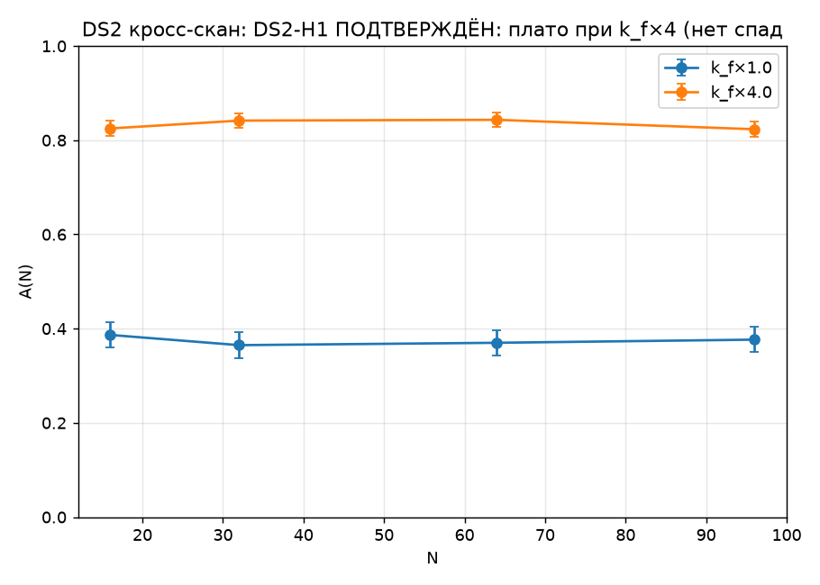
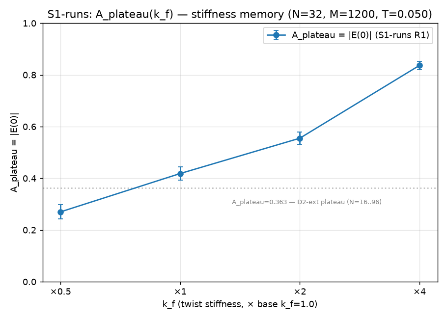
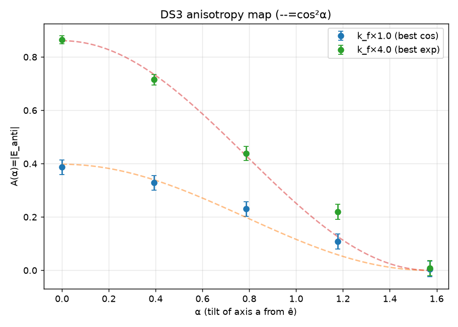
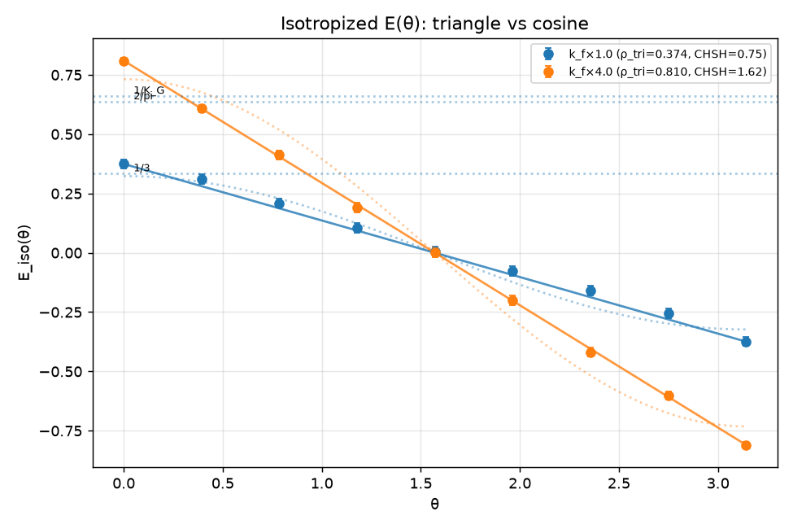

# Frontmatter

**Title:** The Ribbon at the Bell Bound: Mapping the Classical Boundary of a Geometric
Entanglement Ontology

**Author:** Artem Oktiabrev

**Affiliation:** Independent researcher, Ukraine

**Email:** aoktyabrev@gmail.com · **ORCID:** 0009-0003-3626-2002

**Note:** Spelling 'Oktiabrev' confirmed by author (passport form); contact email spelling
differs and is intentional.

---

# Abstract

We report a pre-registered simulation program driving a classical geometric model of
entanglement to its quantitative limit. The ontology represents an entangled pair as one
framed curve in R⁴, its two ends being the observed particles; the framing carries a natural
ℤ₂ topological label, a candidate origin for outcome binarity and spinor structure. The
maximal stake — that classical relaxation reproduces singlet statistics — was registered
alongside the opposite expectation, in writing, before the first run. The stake was lost, and we map how. A structural theorem shows the ℤ₂ label is invisible to any axial boundary
readout; a census finds no empty-support branch; the amplitude shows no resolved decay over chain
lengths 16–96 at two stiffnesses, but is stiffness-controlled and anisotropic — the cosine law survives only along a privileged axis, and honest orientation
averaging collapses it to the triangular correlation of Bell's shared-randomness local model.
Two apparent Bell violations (S = 2.58, 2.39) died in pre-registered audits: an invalid
isotropic estimator, and a setting-dependent post-selection — Pearle's detection loophole. The
corrected family approaches the Bell bound from below (|S| = 1.62) and never crosses it. The
contribution is the mapped boundary: named, quantified walls between this classical geometry
and the singlet state, with a fully version-controlled provenance trail.

---

# 1. Introduction

Take seriously, for the length of one research program, the following
picture: an entangled pair is one extended object. Not two particles
sharing a state, but a single ribbon embedded in a dimension above the
three we see, its two ends being the two intersections with our slice —
so that the perfect correlations of the singlet would need no
communication, there being nothing to communicate between. The picture
has an immediate structural payoff (Section 3): the embedding carries a
ℤ₂ framing class — the framing topology supplies a natural ℤ₂-valued
structural label and the homotopy underlying the 4π belt-trick return.
A physical map from this label to measurement outcomes is an additional
requirement — and Section 5 proves that for axial readout no such map
exists.
The bet this program made — its maximal stake — was that the classical
dynamics of such an object, read by an honest basin measure, would
produce the quantitative statistics of the singlet: the isotropic
−cos θ correlation at unit amplitude, the Born weights, and a CHSH value
of 2√2. The registered expectation, written into the simulation
specification and in the record before the first physics campaign it
governs, was the opposite: "the default expectation, stated honestly
before launch: a sawtooth or p ≈ 1; p = 2 would be a major result
demanding paranoid verification; any outcome is informative …" (SPEC §1,
translated from the Russian original; unedited since).[^lang] The program aimed
at the quantum target while predicting, in writing, that it would
miss — and it missed exactly where the prediction said it would.

The bet was lost. This paper reports how it was lost — exactly,
quantitatively, and, we will argue, usefully. The classical ribbon
realizes more of the singlet than we find commonly appreciated:
anticorrelation of the right sign, a correlation amplitude that survives
chain length unchanged (a kinetic plateau, measured to N = 96 and
verified at two coupling stiffnesses), and a smooth cosine angular law —
though only along one privileged axis. What it cannot realize, we
can now name and number: the topology does not enforce exact outcome
zeros — the census found no topologically forbidden branch, and the
framing invariant is inaccessible to axial readout (a structural theorem:
the invariant that could enforce them lives in precisely the fiber that
axial measurement quotients out; Section 5); honest isotropy collapses the
cosine to the triangular
correlation of Bell's shared-randomness local model (Section 6); and
every apparent Bell violation the program produced — there were two —
died in a pre-registered audit, one to a false symmetry assumption, one
to a rediscovery of Pearle's detection loophole (Section 7). The
measured family moves toward the Bell bound as stiffness grows
(|S| = 1.62 at k_f×4); its deterministic axial limit is expected — not
measured — to reach ρ → 1, S → 2, not 2√2.

We consider the negative answer, so structured, to be the contribution.
A classical ontology was driven to a boundary; the boundary was mapped
rather than lamented; and the walls were named while the program was
still running — several of them named in advance in the pre-registration
record. The method that made this possible is plain: hypotheses with
kill-criteria committed before runs, raw data committed before analysis,
mirror controls, and a standing audit that treats any too-good result as
a defect until proven otherwise. That machinery caught not only the
physics artifacts above but the authors' own errors, in both directions
of the human–AI collaboration that executed the program (Section 9).

[^lang]: Primary program documents (specification, canonical record, campaign
reports) are in Russian; quoted excerpts are translated and marked as such.

## 1.1 Related work and positioning

The walls this program hit are, of course, known walls. Bell's theorem
[Bell1964] bounds every local hidden-variable account, and our isotropized
correlation is his shared-λ model met dynamically; our causal argument for
cosθ-linearity is, as we found after the fact, the measurement-rule
analogue of Gisin's no-go for nonlinear quantum dynamics [Gisin1989;
Gisin1990] — there, nonlinearity of the evolution enables superluminal
signaling; here, nonlinearity of the outcome rule in cos θ does, the
argument's form being Gisin's and its object ours — with the uniqueness of
the quadratic exponent within the chord family this program's own
extension; the post-selection artifact
of our second audit is Pearle's detection loophole [Pearle1970]; and the
impossibility of eliminating the Born postulate within the symmetric pair
is our own methodological observation, standing in the historical line of
Kochen–Specker's demonstration that an outcome measure exists [KS1967] rather
than following from that theorem. We differ from the
classical hidden-variable literature — de Broglie–Bohm's nonlocal dynamics
[Bohm1952a; Bohm1952b], 't Hooft's cellular automata [tHooft2016], Palmer's
invariant-set theory [Palmer2009] —
not in outrunning these theorems, which we do not, but in genre: a
single ontology, pursued to its named limit, under pre-registration,
with every retreat documented in a version-controlled record — and every
rediscovery made after that record began, dated by commit.
To our knowledge the combination — an independently conceived geometric
ontology, a falsification-first simulation program, and a fully
version-controlled provenance trail — has not been reported in this
form. The reader who wants the theory is directed to Section 3; the
reader who wants the boundary, to Section 6; the reader who suspects
that classical models producing S > 2 must be hiding an error somewhere
will find two such errors, found and dissected, in Section 7.

---

# 2. Model

## 2.1 Configuration space

The object is a framed discrete curve in R⁴: nodes x_i ∈ R⁴, i = 0..N−1,
with unit tangents t_i = (x_{i+1} − x_i)/|x_{i+1} − x_i| and the boundary
convention t_{N−1} := t_{N−2}. Each node carries a unit quaternion
u_i ∈ S³ ⊂ H, the lift of the node's normal frame relative to Bishop
(minimal-rotation) transport along the curve; the transport R_i ∈ SO(4)
maps t_i to t_{i+1} and acts as identity on the orthogonal complement of
their span. The full normal frame — not a single normal vector — is
what carries the topology: the normal space of a curve in R⁴ is
three-dimensional, π₁(SO(3)) = ℤ₂, and the ℤ₂ framing class lives in the
sign of the accumulated lift. A single normal (an S² of directions) or a
literal two-sided band (an SO(2) fiber) would carry no ℤ₂ invariant;
"ribbon" names the picture, "framed curve" names the object.

## 2.2 Energy

H = H_stretch + H_bend + H_frame + H_clamp, with
H_stretch = k_s Σ (|x_{i+1} − x_i| − ℓ)²,
H_bend    = k_b Σ (1 − t_i · t_{i+1})  (harmonic only near alignment),
H_frame   = k_f Σ d²(u_i, ū_{i+1}) where ū_{i+1} is u_{i+1} parallel-
transported back along the Bishop frame and d is the geodesic distance
on S³; the twist datum enters through arccos|⟨·,·⟩| and is therefore
blind to the lift sign by construction — a modeling choice, not a
consequence.
Two distinct clamp terms were used and must not be conflated. The frame
clamp, H_clamp = k_c · arccos²(|⟨u_end, U_target⟩|), pins the full
boundary frame and appears only in the D0 invariant-validation runs.
The axial clamp, H_clamp = −k_c (n_end · a)² with n_end the boundary
axis obtained from u_end under SU(2) → SO(3), pins an axis only — the
residual U(1) about it stays free — and is the clamp behind every
scientific number in this paper (D1 through the seed audit). The
axis–frame distinction is not a technicality: the U(1) theorem of
Section 5 lives in exactly the fiber the axial clamp leaves free. The frame
energy is blind to the lift sign by construction; the ℤ₂ invariant is
therefore carried by the kinematics — lift continuity between accepted
steps and singular-step rejection (2.3–2.4) — not by the energy.

## 2.3 Dynamics

Relaxation is a projected Euler–Maruyama scheme, stated as implemented:
per step, gradients g_x, g_u of H; noise ν ~ N(0,1)·√(2·lr·T) added in
the ambient space; for the frame variables the update du = −lr·g_u + ν
is projected onto the tangent space at u_i (du ← du − ⟨du,u⟩u) and
retracted by normalization. The step size lr doubles as the time
step; no metric correction, Itô–Stratonovich term, or retraction
Jacobian is applied; consequently we do not claim that the scheme
samples a Gibbs measure at temperature T, and no stationary measure is
derived — T is an algorithmic noise scale whose observed effect on the
reported amplitude is flat (Section 6). Steps are rejected for
the whole chain on any of three criteria: a temporal lift jump
(⟨u_new, u_old⟩ < 1 − δ_sing), a tangent reversal
(t_i · t_{i+1} < −1 + δ_tan), or a spatial lift wall — a sign change of
the link datum g.w across one step, the passage of a link through a
half-turn (δ_sing = δ_tan = 2·10⁻², band4d.py). The third criterion is
what protects the parity bookkeeping: it is the "leaky lift" detector,
and the rejection fraction falls with lr in the validated regime.
Lift continuity between accepted steps (the sign of u
chosen nearest the previous step) is what makes the parity bookkeeping
well-defined.

## 2.4 Preparation and topological invariant

The even sector is prepared as u ≡ const followed by relaxation; the odd
sector by a linear twist ramp distributing 2π along the chain, followed by
relaxation. The preparation is unbiased with respect to the outcome
branch: the two boundary frames are tilted about random axes with polar
angle arccos(1 − 2ξ), so that each end's axis n_end is uniform on S² — the
branch is never chosen in advance, and the basin decides
(prep_dynamics, measurement.py). Measurement settings a, b are inputs of
the protocol, fixed per run or drawn by the campaign design — never from
the preparation randomness; their independence from λ is a designed
property, used in 2.6(iii). The ℤ₂ parity of a
configuration is the sign of the lift accumulated along the chain with
continuous sign choice, compared against the boundary frames; it is
defined on trajectories free of rejected singular steps, is exactly
conserved on accepted trajectories, and is not spontaneously populated
thermally — charged configurations exist only by preparation.

## 2.5 Measurement and estimator

Outcomes are read locally at the boundaries: s = sign(n_0 · a),
t = sign(n_{N−1} · b), each a function of one end's frame and that end's
setting only. Configurations with |n · a| below a fixed threshold
(0.2, a convention) were classed DEGENERATE and reported as a separate
column in the campaigns; for CHSH estimation this class must not be
discarded — setting-dependent discard is precisely the detection
loophole documented in Section 7, and the corrected estimator
keeps all events with sign(0) → +1 by convention. The correlation
estimator is E(a,b) = (1/n_valid) Σ_{j: valid} s_j t_j with binomial
standard error √(max(1−E², ·)/n_valid), where valid excludes the
DEGENERATE class where it is reported separately; in the campaigns
entering CHSH and the seed audit, degen = 0 and n_valid = M. A
pre-registered cross-seed audit measured the seed-to-seed scatter against
that binomial error at r = 0.88 (11 repeats, N = 32 core cell) and
r = 1.11 (5 points, N = 96), so the quoted errors are honest as
reproducibility measures.

## 2.6 Locality status

Three statements at three strengths, kept separate deliberately.
(i) Readout locality holds by construction: s depends on (u_0, a) only,
t on (u_{N−1}, b) only. (ii) Dynamical locality is not claimed: both
clamps enter one global relaxation functional, so the final
configuration near one end may in general depend on the remote setting;
proving factorization P(s,t|a,b,λ) = P(s|a,λ)·P(t|b,λ) over the
relaxation dynamics would require its stationary measure, which is not
derived. (iii) Operationally, the isotropized protocol is a shared-λ
scheme: λ = (R, initial configuration and noise realization) with
R ~ Haar on SO(3) common to both ends, settings drawn independently of
λ, and local readout — and its measured behavior (the triangular
correlation, S ≤ 2 everywhere after audit) sits strictly inside the
local-hidden-variable region. The paper's Bell-side claims rest on (i)
and (iii); nothing rests on (ii).

---

# 3. Analytical layer

## 3.1 The ontological picture

The ontological picture under test is this: an entangled pair is not two
particles bound by a mysterious connection, but a single extended object —
a ribbon — embedded in a space of dimension higher than the three we
observe. What we call the two particles are the two intersections of this
object with our three-dimensional slice; they are boundaries of one body,
not separate things. On this picture, the correlations of entanglement
would require no communication, because there is nothing to communicate
between — one object simply has one geometry. The picture earns its keep
at the level of structure: the embedding equips the ribbon with framing
classes labeled by ℤ₂ (since π₁(SO(3)) = ℤ₂). The framing topology supplies a natural ℤ₂-valued structural
label and the homotopy underlying the 4π belt-trick return. A physical map
from this label to measurement outcomes is an additional requirement —
and Section 5 proves that for axial readout no such map exists.

What this paper tests, to its limit, is whether the classical dynamics of
such an object can also produce the quantitative statistics of the singlet
state. It cannot — and the ways in which it cannot turn out to be sharply
nameable.

## 3.2 The chord law and the causal derivation of the exponent

The quadratic chord law is a geometric transcription of the quantum
target, not a derivation of it: P(s,t | a,b) = |s·a − t·b|²/8 =
(1 − s·t·(a·b))/4 is the singlet joint distribution rewritten, for
outcome signs s, t = ±1 at clamp orientations a, b. In that form it
yields E = −cos θ, the half-angle probabilities cos²(θ/2), no-signaling,
and order-independence — as it must, being the same distribution.

The derivational content lies one level up. Embedding the law in the
family P ∝ |s·a − t·b|^p, within this ansatz and its stated partially
entangled extension, the no-signaling condition singles out p = 2 from
both sides: any p ≠ 2 — and any admixture ε ≠ 0 of a symmetric
deformation — produces a superluminal telegraph, the marginal at one end
shifting with the remote setting by Δ = 0.146 at p = 1, 0.081 at p = 3,
0.072 at ε = 0.2 (at q = 0.85, Δ = ε·|(1−2q)³−(1−2q)| for the deformation
family). Causality pins p = 2 within this ansatz — we make no claim of a
general derivation of the Born rule, and the same family contains, at
p → ∞, the Popescu–Rohrlich box [PR1994] (CHSH → 4): no-signaling alone selects
neither the quantum correlation nor ours. As we later found, this argument is the
measurement-rule analogue of Gisin's no-go for nonlinear quantum dynamics
[Gisin1989; Gisin1990]: there, nonlinearity of the evolution enables
superluminal signaling; here, nonlinearity of the outcome rule in cos θ
does — the argument's form is Gisin's, its object is ours. Gisin refutes a
nonlinear dynamics; we derive a rule. The two-sided uniqueness of p = 2
within the chord family is this program's extension of it.

## 3.3 The conservation law of the postulate

What causality can do, internal consistency cannot. A symmetric-pair
consistency battery — no-signaling, order-independence, probabilities
confined to [0,1], and repeatability (f(±1) = 1, 0) — is passed by an
entire ε-family of non-Born measures; consistency of the pair does not
fix the quadratic law. A measure over microconfigurations can nonetheless
be constructed: a density of microscopic twist axes with deterministic
relaxation reproduces the honest cos²(θ/2) at a single end. But the
postulate has then moved from the probability rule into the measure — it
relocates between rule, measure, and branch weights, and within the
symmetric pair it never annihilates. Only the external principle of
causality (3.2) eliminates alternatives.

We call this relocation the conservation of the postulate — a
methodological observation within the tested model family, not a
consequence of the Kochen–Specker theorem [KS1967]. (Gleason's theorem
[Gleason1957] is the
nearest formal relative for measure-uniqueness, with its own dimensional
premises; we do not invoke it.) The single-end construction stands in the
historical line of Kochen–Specker as a demonstration that an
outcome measure exists; we draw no inference from that theorem to our
observation. The observation shaped every later phase: any mechanism that
seemed to derive the Born weights was audited for where it had hidden
them instead.

## 3.4 From analytical layer to dynamical program

Two analytical results sharpened into simulation targets. First, the
sawtooth: a uniform microphase measure with conical outcome basins —
the natural first reading of the ribbon — gives the exact triangular law
E = 2θ/π − 1 — the textbook local-realistic correlation at full
amplitude; the dynamical model of Section 6 later reached exactly this
form, but with amplitude ρ < 1 set by source alignment, the analytical
layer supplying the limiting shape and the dynamics its measured
deficit. This was recorded as an analytical counterexample in the
canonical log, and the arrival of the isotropized dynamics at the same
form (Section 6.4) was not anticipated. Second, basin measure
scaling as |chord|¹ gives the sawtooth while |chord|² gives Born — so
the question "where does the second power come from?" acquired a
geometric face and is posed, formalized but unsolved, in Section 8.3.
The simulation program of Sections 4–7 is the systematic attempt to make
an elastic, thermal, topologically framed ribbon produce dynamically what
the analytical layer showed it must produce structurally — and the
measured ways in which it does not.

---

# 4. Methods

## 4.1 Pre-registration and controls

Every campaign carries a pre-registration file fixing hypotheses, quantitative expectations,
and kill-criteria. The commit record proves three properties at three strengths: no
pre-registration was ever edited after entering the record (all eight files: one commit each);
every pre-registration entered the record before the analysis it governs (raw-data commits
precede analysis commits throughout); and for the final campaign, the seed audit, the
pre-registration was committed before the runs themselves. We claim the stronger "registered
before runs" as working practice throughout; the commit record proves it directly for the last
campaign and proves "registered before analysis, never edited" for all. A representative entry
(D0, hypothesis D-H2; translated from the Russian original)
reads: "ℤ₂ parity is exactly conserved
on accepted trajectories, and the singular-rejection fraction → 0 as dt → 0; kill: if the
rejection fraction does not fall with dt, the parity is an artifact of the filter"
(D0_prereg.md). Registering the failure condition in advance is what let a null result count
as a result rather than as a disappointment to be explained away.

The analysis order was strict: every stage whose result required a fit, a flip, or a model
comparison committed its raw measurements before any analysis touched them, as a `*-raw`
commit preceding a `*-analysis` commit; the two infrastructure stages, D0 and D1, produced
deterministic validations rather than fitted numbers and are single commits (the commit chain
is listed in Section 9.1). Every
campaign carried controls: an unbiased preparation sampler (boundary axes drawn uniformly on
S², sector preparation without bias, so the branch is never chosen in advance and the basin
decides; measurement.py), mirror pairs (a, b) ↔ (−a, −b), block convergence of the reported
observable, an explicit DEGENERATE class for undetermined basins, and — for the central
scaling claim — a pre-registered cross-seed audit of the quoted errors (Section 4.2). A
standing kill-criterion
treated any CHSH > 2 in a manifestly local model as a protocol error to be audited before
interpretation; it fired twice, and both times caught a method artifact rather than physics
(Section 7).

This machinery was not incidental to the working arrangement but demanded by it. The program
was run under an explicit division of roles between generative-AI tooling — design and
pre-registration on one side, implementation, runs, and verification on the other — and the
human author, who made all decisions and held veto (Section 9.2 and the Supplementary
methodological note). Pre-registration, kill-criteria,
and the raw-before-analysis order are controls over both AI roles: they bind the design and
the execution to commitments made before the data existed, which is precisely the point at
which the shared hope for a positive result would otherwise leak into the pipeline.

## 4.2 Repeatability and reproducibility

Two distinct properties are worth separating. Repeatability is exact: every stage fixes a
PRNGKey seed protocol and commits its raw data, so the same seed returns the same number and
any figure can be regenerated from a named commit. Reproducibility — whether a result
survives a change of seed — is a separate question, and we measured it rather than assumed
it: a dedicated seed audit re-ran the N = 32 and N = 96 cells under twelve fresh base keys
and found the cross-seed scatter consistent with the quoted binomial errors (r = 0.88 and
1.11; Section 6.1, seed audit commit a26f76b).

The phase history of the program (phases A–D) and the implementation detail — frame algebra,
test coverage by invariant, numerical precision — are given in the Supplementary Information (repository: https://github.com/aoktyabrev/ribbon-at-the-bell-bound).

---

# 5. No-go results

The program's negative results are its most durable ones. We state them in
increasing order of strength: a gauge-blindness property of axial
observables, its sharpening into a structural theorem about where the
topological invariant lives, and the census result showing that topology
constrains no outcome by measure alone.

## 5.1 Gauge blindness of axial observables

Every observable used by a physical measurement in this model is axial: a
function of the boundary axis n = R(q)ê, where R is the rotation obtained
from the frame quaternion q under the double cover SU(2) → SO(3). Any
such function factors through SO(3) by construction, and the kernel of the
covering map is exactly the ℤ₂ we care about: two frame configurations
differing only by the lift sign (q vs −q) produce identical axial fields
everywhere, hence identical statistics for every axial observable. In
phase B/C this appeared as an empirical wall — kinks without topological
protection relaxed away, and charged configurations, with energies of order
k_e·(π/2..π)², remained thermally unpopulated for T ≪ k_e. At that stage
one could still hope that a cleverer local readout might see the charge.

## 5.2 The U(1) theorem: axis ≠ frame

Phase D closed that hope. In the R⁴ embedding, the boundary clamp fixes an
axis, but an axis determines a frame only up to a residual U(1) of rotations
about it — and the ℤ₂ framing class lives precisely in that residual layer,
as the boundary sign of the lift. The construction is explicit: the
lift-twin test builds pairs of configurations with identical axial fields
n_i at every site (max |Δn| = 0) and opposite parity. Every candidate
readout we constructed — coorientation of the frame against the slice
normal, the sign of the nearest interior w-coordinate, windowed relative
lift — passed the locality test (stable at window k ≤ 8) and, without
exception, returned identical statistics on the twins. The blindness was
not the price of enforcing locality; every local slice datum we could build
was blind. We registered this in advance as a named wall ("blind slice"),
and it fired. The theorem-level statement: a ℤ₂ framing invariant of an
embedded curve in R⁴ is invisible to any boundary observable that factors
through the axis, because ℤ₂ ⊂ ker(S³ → SO(3)) — the invariant is stored
exactly in the fiber that axial physics quotients out. The framing
topology thus supplies the ℤ₂ label and the 4π homotopy (Section 3) — and
this theorem closes the other half: for axial measurement, no physical map
from that label to outcomes exists. The label is real; the readout that
was meant to express it provably cannot. This tension is, we believe, the
sharpest single lesson of the program.

## 5.3 Sector blindness of the axial signal

The complement of 5.2, measured directly: at matched preparation, the axial
correlation amplitude is statistically identical in the even and odd
topological sectors (ΔA = −0.040 ± 0.038 at N = 32, M = 1200). The
correlation carried by axial readout is generic chain correlation,
controlled by coupling stiffness (Section 6), not by topology. An earlier
apparent sector shift (~0.07 at M = 200) did not survive the statistics
increase and is withdrawn.

## 5.4 The census result: topology forbids no outcome

Pre-registered hypothesis D-H3a proposed that in the odd sector at θ = 0
the aligned outcome branch has empty support — a geometric superselection
that would have supplied the exact zeros the Born rule requires. The
census refuted it: all 16 cells of {sector} × {branch} × {θ ∈ {0, π}}
contain non-singular representatives, found both numerically (constrained
minimization from ≥20 diverse starts per cell) and by an explicit
homotopy argument — the residual U(1) layer of 5.2 absorbs the framing
constraint, so a 2π twist of the fiber connects nominally forbidden
configurations to allowed ones. The kill-criterion fired as
registered: there is no topological empty-support prohibition in this
geometry (non-empty support established by explicit representatives;
measure statements are a separate, dynamical question).
Combined with 5.2, the two results close both readings of the phase-D
bet: topology cannot be read locally, and it forbids nothing globally.
What survives of it is one number — the length-stable amplitude (no resolved decay over the
measured range) of
Section 6 — and the structural explanation of binarity itself.

---

# 6. Quantitative boundary

## 6.1 The plateau

The one quantity the ribbon carries that does not dilute with length is the axial readout
amplitude of the odd sector. Fit against three models — a constant A_plateau, a power law A·N^−γ,
and a saturating A_plateau + c·N^−γ — the constant is substantially preferred among the three
tested models (ΔAICc = 6.36): A_plateau = 0.363 ± 0.012, with the power law's exponent fitted
negative (no decay) (D2-ext; commit 2784edf). We write A_plateau, and avoid A∞: the limit
N → ∞ is not measured; what is measured is no statistically resolved decay over 16 ≤ N ≤ 96. The plateau holds at a second stiffness: cross-scanning N ∈ {16, 32, 64, 96}
at k_f×1 and k_f×4, the amplitude change from N = 16 to N = 96 is +0.010 ± 0.038 and
+0.002 ± 0.023 respectively — flat within error at both couplings (DS2; commit f928dd4). The evidence is
bounded: N ∈ [16, 96], k_f ∈ {×1, ×4}. Within that window the plateau is kinetic, not
thermodynamic — there is no statistically resolved temperature dependence over
T ∈ {0.025, 0.05, 0.10} (A(T) = 0.368 / 0.397 / 0.353, within σ ≈ 0.027) (S1-runs;
commit a9cef7b) — so it is a property of the basin structure, not of thermal fluctuation. The quoted errors are binomial,
and a dedicated seed audit confirms they are honest as a measure of reproducibility: eleven
independent repeats of the N = 32 cell scatter with s_seed = 0.024 against a binomial
σ = 0.027, a ratio r = 0.88 (χ² = 7.7 / 10, p = 0.66), and the ratio does not grow with chain
length (r = 1.11 at N = 96) (seed audit; commit a26f76b).

*Fig. 1. The plateau. (a) D2-ext: A_N = |E(0)| against chain length N ∈ {16, 32, 48, 64, 96}
at M = 1200 replicas, with the three fitted models — constant M0 (A_plateau = 0.363, dotted), power
law M1 (γ = −0.03, i.e. fitted growth rather than decay, dashed), and saturating M2 (solid).
M0 is substantially preferred by ΔAICc = 6.36 (commit 2784edf); M2 is degenerate on this data
and shown for completeness. (b) DS2 cross-scan: A(N) at k_f×1 and k_f×4, flat within error at
both stiffnesses (commit f928dd4).*

## 6.2 Origin of the amplitude

The amplitude is stiffness-controlled. Sweeping the twist coupling gives
A(k_f) = 0.27 / 0.42 / 0.56 / 0.84 for k_f × {0.5, 1, 2, 4} — a strong
monotone dependence that refutes any fixed geometric-measure origin
(S1-runs R1; commit a9cef7b). The plateau value A_plateau = 0.363 ± 0.012 belongs
to the D2-ext campaign (N ∈ [16, 96] at its baseline setup); the stiffness
sweep, run at N = 32, gives 0.418 ± 0.026 at nominal k_f×1 — consistent in
scale, not identical — the gap reflects seed-to-seed sampling scatter,
quantified in the seed audit (s_seed = 0.024). This only sharpens the point: the amplitude is the
reading of a dial, not a constant of the model; the weakness of the signal
is a property of soft coupling, not a limit of the mechanism. At θ = 0 the
amplitude is, by identity, A = 2·P_aligned − 1 (P_aligned = 0.681 for the
D2-ext plateau), so explaining the amplitude means explaining the
aligned-basin weight. Two measured facts locate that
weight in kinetics rather than thermodynamics. First, it is flat in
temperature (Section 6.1), while any Boltzmann reading of the landscape
would move with T: the census finds the four branch minima spread over
0.22 in energy (branch means −3.78 for both branches, Δ ≈ 0.006), and no
assignment of Boltzmann weights to these energies reproduces a
68/32 split with no resolved temperature dependence (D1 census; D_synthesis_S1 §2).
Second, it is flat in chain length from N = 16 to N = 96 at both measured
stiffnesses (Section 6.1), while an equilibrium chain correlation with a
finite correlation length would decay. What remains is relaxation itself:
the split is set by the geometry of the attraction domains under the
clamped dynamics — a domain volume controlled by coupling stiffness. This
is the reading fixed in the canonical record after the cross-scan (commit
311d3ae): the amplitude is a stiffness-controlled kinetic correlation,
athermal and sector-blind (Section 5.3).

*Fig. 2. A_plateau(k_f) — stiffness memory. Four points with 1σ error bars from the frozen
S1-runs R1 raw data (N = 32, M = 1200, T = 0.05; commit a9cef7b). Dotted line: the
D2-ext plateau A_plateau = 0.363 of Section 6.1, measured over N ∈ [16, 96].*

## 6.3 Anisotropy map

The cosine angular law the correlation appears to follow is anisotropic. Tilting the clamp axis
a by α from the privileged axis ê and reading the antiparallel amplitude A(α) = |E_anti|, the
signal decays smoothly to zero at α = π/2: from 0.387 to 0.005 at k_f×1 and from 0.865 to 0.008
at k_f×4 (DS3; commit 0fb5452). The best-fit law is cos α at k_f×1 and steepens to ~cos²α (an
exponential fitting equally well) at k_f×4. The axis ê — simultaneously the twist axis and the
readout axis — is strongly privileged; the cosine dependence exists only along it, which is
exactly why the isotropic CHSH [CHSH1969] estimator of Section 7 was invalid.

*Fig. 3. Anisotropy map. A(α) = |E_anti| as the clamp axis a is tilted by α from the
privileged axis ê, at k_f×1 (best fit cos α) and k_f×4 (best fit exp ≈ cos²α); dashed curves
are cos²α. The signal decays to zero at α = π/2 at both stiffnesses: the cosine law exists
only along ê (commit 0fb5452).*

## 6.4 The trilemma and the triangle

Averaged honestly over the shared randomness λ = (R, n_A, n_B) — where R ~ Haar on SO(3) is
the ribbon's orientation, common to both ends through the geometry, while the settings n_A and
n_B are drawn independently — the correlation is not a cosine. Fitting the
isotropized E(θ) against both forms, the triangular local-realistic function E = −ρ(1 − 2θ/π)
beats the cosine by a wide margin in χ²: 8 vs 39 at k_f×1 and 1 vs 218 at k_f×4 — the data lie
on the straight line, not the curve (DS3; commit 0fb5452). This is the shared-λ local model's
signature [Bell1964], and its CHSH value is exactly S = 2ρ, with ρ the source-alignment amplitude:
ρ = 0.374 / 0.810 gives |S| = 0.75 / 1.62 at k_f × {1, 4}. Three properties therefore trade
off and cannot be held together: a cosine form exists only anisotropically (6.3); honest
isotropy forces the triangle (this subsection); and the amplitude ρ is bought with stiffness
(6.2). The measured family moves toward the Bell bound as stiffness grows: |S| = 1.62 at
k_f×4 sits a measured distance 2 − 1.62 = 0.38 short of it. Its deterministic axial limit is
expected — not measured — to reach ρ → 1, |S| → 2.

*Fig. 4. Triangle versus cosine. The honestly isotropized E(θ) at k_f×1 and k_f×4: the data
lie on the straight triangular law −ρ(1 − 2θ/π) (solid, ρ = 0.374 / 0.810, CHSH = 2ρ =
0.75 / 1.62), not on the cosine (dotted). Horizontal reference lines mark the literature
values 1/3, 2/π, 1/K_G, which were formulated for a cosine LHV and are not direct bounds on
a triangular one (DS3 §4; commit 0fb5452).*

## 6.5 Synthesis

The k_f family is a classical frontier: a one-parameter sweep of local models measured from
inside the classical region, moving toward the Bell bound as stiffness grows and expected —
not measured — to reach CHSH → 2 in its deterministic axial limit. The quantum
target — an isotropic cosine with unit amplitude and CHSH = 2√2 — lies outside the family on
three independent axes at once: amplitude (bounded by ρ < 1), form (isotropy forces a triangle,
not a cosine), and isotropy itself (the cosine survives only along the privileged axis). No
single knob moves the ribbon toward it; that is the quantitative content of the phase-D bet's
outcome, and its interpretation is deferred to Section 8.

---

# 7. Case studies in self-correction

A hidden-variable research program faces a specific epistemic hazard: the
researcher wants the model to violate a Bell inequality, and the pipeline is
built by the same people who hold that hope. We therefore pre-registered,
before any CHSH [CHSH1969] campaign, a standing kill-criterion: any result S > 2 in a
manifestly local model is treated as evidence of a protocol error, triggering
a full audit before any interpretation. This criterion fired twice. Both
times it caught an artifact of method, not physics — and both artifacts turn
out to be textbook failure modes with decades of history in the Bell-test
literature. We report them in detail because we believe the mechanism of
their capture is a result in its own right.

## 7.1 Audit 1: the false-isotropy artifact (DS2)

Applying the standard isotropic CHSH estimator to our stiff-coupling data
(k_f×4) yielded |S| = 2.58, comfortably above the classical bound. The
pre-registered trigger halted interpretation. Direct measurement of all four
correlators — rotating both boundary clamps rather than assuming rotational
symmetry — revealed E(π/2, π/4) ≈ 0.007 against E(0, π/4) = −0.595: the
system is strongly anisotropic, with the twist axis privileged, and the
isotropic estimator is simply invalid for it. The directly measured value is
|S| = 1.21, safely sub-classical. The audit had a retroactive cost we accept
openly: all previously quoted CHSH values (phase C: 1.48; D2: 0.73–1.25) were
computed with the same invalid estimator and are withdrawn. They remain in
the canonical record, struck through, with the revision documented (commit
311d3ae).

## 7.2 Audit 2: the detection loophole, rediscovered from the inside (DS3)

The isotropization protocol — the shared randomness λ = (R, n_A, n_B), with
R ~ Haar on SO(3) the ribbon's orientation, common to both ends through the
geometry but not available to the experimenter, and the settings n_A, n_B drawn
independently (Section 6.4) — produced |S| = 2.39. Since the
construction is manifestly local, Bell's theorem [Bell1964] guarantees this is a bug;
the trigger fired again. The audit located it in event selection: replicas
with a weak axial projection (|proj| < 0.2) were being discarded as
DEGENERATE — and the discard rate itself varied with the measurement
setting, from 21% of events at the correlation extremes (θ = 0, π) to a peak of
37–38% at intermediate angles (36–37% at the CHSH angles π/4 and 3π/4). This setting-dependence is
not incidental to the artifact; it is the artifact. Setting-dependent post-selection is precisely the
detection loophole of Pearle [Pearle1970] — the class of local models that forced
four decades of loophole-closing in experimental Bell tests. Our pipeline
reproduced the disease and, once the cut was removed (all events kept,
sign(0) → +1 by convention), the cure: |S| = 1.62 at k_f×4, again
sub-classical.

*Table 1. Every CHSH value the program produced, and its fate. The isotropic estimator
S = 3E(π/4) − E(3π/4) assumes E(a, b) = E(|a − b|); the ribbon is strongly anisotropic
(Section 6.3), so every value computed with it is withdrawn. Withdrawn values are struck
through, not deleted (canon "Ревизия CHSH"; commit 311d3ae).*

| value | campaign | method | status | where corrected |
|---|---|---|---|---|
| ~~≈ 1.48~~ | phase C | isotropic estimator | withdrawn: invalid isotropic estimator | superseded by DS2 direct (§7.1) |
| ~~0.73–1.25~~ | D2 | isotropic estimator | withdrawn: invalid isotropic estimator | superseded by DS2 direct (§7.1) |
| ~~2.39~~ | DS3 (primary) | direct, but with setting-dependent DEGENERATE post-selection (\|proj\| < 0.2, ~36% of replicas) | withdrawn: setting-dependent post-selection — the detection loophole (canon also charges the isotropic estimator: double artifact) | `analysis_ds3`, post-selection removed → 1.62 (§7.2; commit 0fb5452) |
| **1.21** | DS2 | direct, both ends rotated, no post-selection | valid: direct | — |
| **0.75 / 1.62** | DS3 | isotropized shared randomness λ = (R, n_A, n_B); CHSH = 2ρ at k_f × {1, 4} | valid: direct | — |

No value survives audit above 2; the ribbon is always sub-classical.

## 7.3 What the two audits establish

First, a negative result of unusual strength: across the entire program, no
Bell violation survived an audit. Every S > 2 traced to an identifiable
protocol error, and the corrected values sit strictly inside the classical
region — converging, in the stiff-coupling limit, toward the Bell bound from
below (Section 6). Second, a methodological claim: the pre-registered
"too-good-to-be-true" trigger is not decoration. Both artifacts — invalid
symmetry assumption, setting-dependent post-selection — are historically
documented failure modes that took the community years to identify in
experimental contexts. A standing kill-criterion, registered before the data
existed and owned by no one at the table, identified both within a single
analysis cycle each. Third, a note on provenance: a theoretical
entry in our canonical log (the "Bell trap", §2.7 of the model note) derives
that any shared-λ, locally deterministic readout of the ribbon must produce
the triangular correlation function — a forced consequence, not a guess; the
isotropization campaign landed on exactly that triangle (Section 6). We
deliberately rest this point on the logical status of the prediction rather
than on its calendar priority, which our commit history cannot independently
establish. The program's negative
predictions were confirmed by its own later data — which is, we would argue,
the behavior one should demand of an honest hidden-variable program before
trusting any of its positive claims.

---

# 8. Discussion

## 8.1 The final lemma

Phase D leaves the program with a lemma sharper than the one it started
with. The classical ribbon realizes, from geometry alone: a natural ℤ₂
structural label with the 4π belt-trick homotopy (the candidate origin of
outcome binarity and spinor structure — a candidacy Section 5 shows axial
readout cannot redeem), anticorrelation (the singlet sign), a correlation amplitude
that does not dilute with chain length (kinetic plateau, two stiffnesses,
N ≤ 96), and a smooth cosine angular law — but only along a privileged
axis. It does not realize: exact zeros (no outcome is forbidden by
measure, and the invariant that could forbid one is unreadable by axial
measurement — Sections 5.4 and 5.2), an isotropic cosine (honest orientation averaging
forces the triangular law; Section 6.4), or any Bell violation (every
S > 2 died in audit; Section 7). The boundary between the two lists is
not a fog but a set of named, quantified walls.

## 8.2 Relation to the classical theorems

The program repeatedly rediscovered, from the inside and with its own
numbers, results that mark the classical-quantum boundary. Our causal
argument for cosθ-linearity (the qubit Born rule) is the measurement-rule
analogue of Gisin's no-go for nonlinear quantum dynamics [Gisin1989;
Gisin1990]: there, nonlinearity of the evolution enables superluminal
signaling; here, nonlinearity of the outcome rule in cos θ does — the
argument's form is Gisin's, its object is ours. The uniqueness of the Born
exponent p = 2 within the chord family is this program's own extension of
the same causal argument; the triangular correlation of the isotropized ribbon is Bell's
shared-λ local model [Bell1964], a textbook construction that the program first met
as an analytical counterexample (the "saw", session 3) and then found
realized dynamically by its own elastic ribbon — the analytical
counterexample and the dynamical outcome bracketing the program; the
setting-dependent post-selection artifact of DS3 is Pearle's
detection loophole [Pearle1970], reproduced and repaired in one audit cycle; and the
relocation of the Born postulate between rule, measure, and branch
weights — with no elimination available within the symmetric pair itself,
only by the external principle of causality (Section 3) — is our own
methodological observation within the tested model family, standing in
the historical line of Kochen–Specker's demonstration that an
outcome measure exists [KS1967], but not derived from that theorem. The number
makes the wall
tangible twice over: even the family's deterministic limit point (ρ → 1)
yields the triangular E(45°) = −0.500 — the value the session-3 analytical
construction already produced (−0.502, canon §2.7) — against the quantum
−0.707; and the measured ribbon does not reach even that, giving −0.187 and
−0.405 at the two stiffnesses. We take the convergence itself as evidence: a program that
honestly explores a classical ontology does not wander freely — it is
funneled onto the same walls the theorems describe, and arrives at them
with measured coordinates.

## 8.3 The open problem

One exit remains formally open, registered in the canonical record as the
open problem E: whether a physical fiber-breaking invariant of the R⁴
embedding (a second-fundamental-form datum, or a preferred slice normal)
can produce an empty aligned-branch basin together with a smooth isotropic
cosine — that is, an escape from the trilemma of Section 6.5. We
record the obstacles as honestly as the opening — both are our judgment
from the phase-D results, not established results themselves: any energetic anchoring
of the frame is another stiffness dial, moving the model along the
classical family rather than off it; and a shared external frame is
shared randomness, bounded by Bell's theorem regardless of its geometric
pedigree. A related conjecture from the theory line — that basin measure
scaling as the square of the chord ("the ribbon has a face") would
reproduce the Born weights — is formalized to the point of an explicit
measure, μ(B(s,t)) = |s·a − t·b|²/8, and posed as an open problem —
construct it for all clamp orientations, or prove an impossibility lemma
naming the minimal missing structure; it is unsolved, not untested
folklore [conjecture]. We consider these open in the technical sense, not
the hopeful one.

## 8.4 The status of the ontology, and of the classical route

The ontological picture itself — the pair as one extended object, with
binarity and spinority descending from its framing topology — is not
refuted by anything in this paper. What is refuted, by construction and
at scale, is the proposition that the *classical dynamics* of such an
object reproduces singlet statistics. We state our position beyond the
minimal one: we regard the classical route as exhausted within the
explored model class — framed-curve discretizations with axial readout,
over the measured parameter range — and expect further classical
modifications inside this class to rediscover the named walls; outside it,
Section 8.5 lists what was not tested. The U(1) theorem shows that the topological invariant carrying
the ontology's explanatory power is structurally unreadable by axial
measurement; the trilemma shows that amplitude, angular form, and
isotropy cannot be purchased together anywhere in the accessible family;
and the measured family moves toward the Bell bound as stiffness grows (|S| = 1.62 at
k_f×4), its deterministic axial limit expected — not measured — to reach S → 2.
A solution to the open problem E remains the one exit we have not been
able to close. If the ribbon picture has a future, it lies in a quantum
dynamics of the extended object — a question this paper does not open.

## 8.5 Limitations

The scope of the evidence is narrower than the scope of the claims a
reader might extrapolate, and we state it exactly. The dynamics tested is
classical throughout; nothing here bears on a quantum dynamics of the
same object. The discretization is one class among the possible: a framed
curve in R⁴ with axial boundary readout — a triangulated surface, or
non-axial boundary couplings, were designed around but not simulated. The
U(1) theorem is a statement about axial (SO(3)-factorizable) boundary
data, not about all conceivable measurements. And the quantitative
results are bounded: N ∈ [16, 96], k_f ∈ {×1, ×4}, one temperature regime
verified flat. Within these bounds the walls are measured; beyond them
they are extrapolated.

## 8.6 What we take to be the product

Beyond the specific results, we submit the method as a product in its own
right: an ontology driven to its named limit by pre-registration,
kill-criteria owned by no one at the table, raw-before-analysis commit
discipline, and a standing audit that fires on results that are too good.
This machinery caught two textbook artifacts within one analysis cycle
each (Section 7) and forced every retreat to be documented rather than
forgotten. The program's answer to its opening bet is negative, exact,
and reusable — and the same machinery is now free to be pointed at the
next idea. Everything should be tested; that is how one either learns
something new, or confirms something known — and both are wins.

---

# 9. Code, Data & AI methodology

## 9.1 Code and data availability

All code, data, and pre-registrations are in the repository: the phase A–C toolkit in
`sim/src/ribbon_sim/`, the phase-D model and campaigns in `sim/phase_D/`, and the frozen raw
measurements in `sim/phase_D/results/*.json`.

Every stage whose result required a fit, a flip, or a model comparison committed its raw
measurements before any analysis touched them, as a `*-raw` commit preceding a `*-analysis`
commit: D2 (7a2f18d → 9d7b8e9), D2-ext (624b628 → 2784edf), S1-runs (704e29c → a9cef7b),
DS2 (a9f6cfe → f928dd4), DS3 (3d8dd67 → 0fb5452), and the seed audit (2b946ae
pre-registration → ecff715 raw → a26f76b analysis). The two infrastructure stages, D0 and D1,
produced deterministic validations rather than fitted numbers and are single commits
(f25694d, 81cc7da). Each campaign's hypotheses and kill-criteria are fixed in a committed
`*_prereg.md`, and what the record proves is graded (Section 4.1): no pre-registration was
ever edited after entering it (eight files, one commit each); all entered it before the
analysis they govern; and for the seed audit — the one campaign whose pre-registration was
committed as its own step (2b946ae) — before the runs as well.

Repeatability is exact: each run script fixes its PRNGKey seed protocol, so the same seed
returns the same number, and every figure in this paper can be regenerated from a named commit
by running its committed script — `analysis_ext.py` (d2ext_scaling.png), `analysis_ds2.py`
(ds2_cross.png), `analysis_ds3.py` (ds3_aniso.png, ds3_iso.png), `plot_s1runs_kf.py`
(s1runs_kf.png). Reproducibility — whether a result survives a change of seed — is a separate
property, and we measured it rather than assumed it: a pre-registered audit re-ran the N = 32
and N = 96 cells under twelve fresh base keys, and the cross-seed scatter came out consistent
with the quoted binomial errors (r = 0.88 over eleven repeats of the core cell, r = 1.11 at
N = 96; seed-audit report, commit a26f76b).

## 9.2 Use of generative AI

Generative AI tools (Anthropic Claude) were used for research planning and experimental
design, software implementation, code review, source checking, and manuscript drafting. The
author made all scientific decisions, verified the reported results, and accepts full
responsibility for the manuscript.

The detailed working arrangement — the three-party division of roles, the pre-registration and
raw-before-analysis order as controls over both AI roles, and the record of errors caught in
both directions — is given in the Supplementary Information (repository: https://github.com/aoktyabrev/ribbon-at-the-bell-bound).

## 9.3 Tooling

No proprietary tooling beyond the AI assistants named was used; all analysis code is in the
repository.

---

# References

[Bell1964] J. S. Bell, "On the Einstein Podolsky Rosen paradox", *Physics Physique Fizika*
**1**, 195–200 (1964). DOI: 10.1103/PhysicsPhysiqueFizika.1.195.

[CHSH1969] J. F. Clauser, M. A. Horne, A. Shimony, R. A. Holt, "Proposed experiment to test
local hidden-variable theories", *Phys. Rev. Lett.* **23**, 880–884 (1969).

[KS1967] S. Kochen, E. P. Specker, "The problem of hidden variables in quantum mechanics",
*J. Math. Mech.* **17**, 59–87 (1967).

[Gleason1957] A. M. Gleason, "Measures on the closed subspaces of a Hilbert space",
*J. Math. Mech.* **6**(6), 885–893 (1957).

[Gisin1989] N. Gisin, "Stochastic quantum dynamics and relativity", *Helv. Phys. Acta* **62**,
363–371 (1989).

[Gisin1990] N. Gisin, "Weinberg's non-linear quantum mechanics and supraluminal
communications", *Phys. Lett. A* **143**(1–2), 1–2 (1990). DOI: 10.1016/0375-9601(90)90786-N.

[Pearle1970] P. M. Pearle, "Hidden-variable example based upon data rejection", *Phys. Rev. D*
**2**(8), 1418–1425 (1970). DOI: 10.1103/PhysRevD.2.1418.

[PR1994] S. Popescu, D. Rohrlich, "Quantum nonlocality as an axiom", *Found. Phys.* **24**(3),
379–385 (1994). DOI: 10.1007/BF02058098.

[tHooft2016] G. 't Hooft, *The Cellular Automaton Interpretation of Quantum Mechanics*,
Fundamental Theories of Physics vol. 185, Springer (2016). Print ISBN 978-3-319-41284-9;
eBook ISBN 978-3-319-41285-6; DOI 10.1007/978-3-319-41285-6. Open access (Springer Open).

[Palmer2009] T. N. Palmer, "The Invariant Set Postulate: a new geometric framework for the
foundations of quantum theory and the role played by gravity", *Proc. R. Soc. A* **465**(2110),
3165–3185 (2009). Preprint: arXiv:0812.1148.

[Bohm1952a] D. Bohm, "A suggested interpretation of the quantum theory in terms of 'hidden'
variables. I", *Phys. Rev.* **85**(2), 166–179 (1952). DOI: 10.1103/PhysRev.85.166.

[Bohm1952b] D. Bohm, "A suggested interpretation of the quantum theory in terms of 'hidden'
variables. II", *Phys. Rev.* **85**(2), 180–193 (1952). DOI: 10.1103/PhysRev.85.180.

---

---

## Figure and table list

All figures are produced by committed scripts from committed raw data; each can be
regenerated from a named commit (Section 9.1).

| #        | subject                          | file                                 | script                               | § |
|----------|----------------------------------|--------------------------------------|--------------------------------------|---|
| Fig. 1   | plateau A(N)                     | `d2ext_scaling.png`, `ds2_cross.png` | `analysis_ext.py`, `analysis_ds2.py` | 6.1 |
| Fig. 2   | A_plateau(k_f), stiffness memory | `s1runs_kf.png`                      | `plot_s1runs_kf.py`                  | 6.2 |
| Fig. 3   | anisotropy map A(α)              | `ds3_aniso.png`                      | `analysis_ds3.py`                    | 6.3 |
| Fig. 4   | triangle vs cosine (isotropized) | `ds3_iso.png`                        | `analysis_ds3.py`                    | 6.4 |
| Table 1  | CHSH revision: withdrawn vs valid | inline                              | —                                    | 7.2 |
